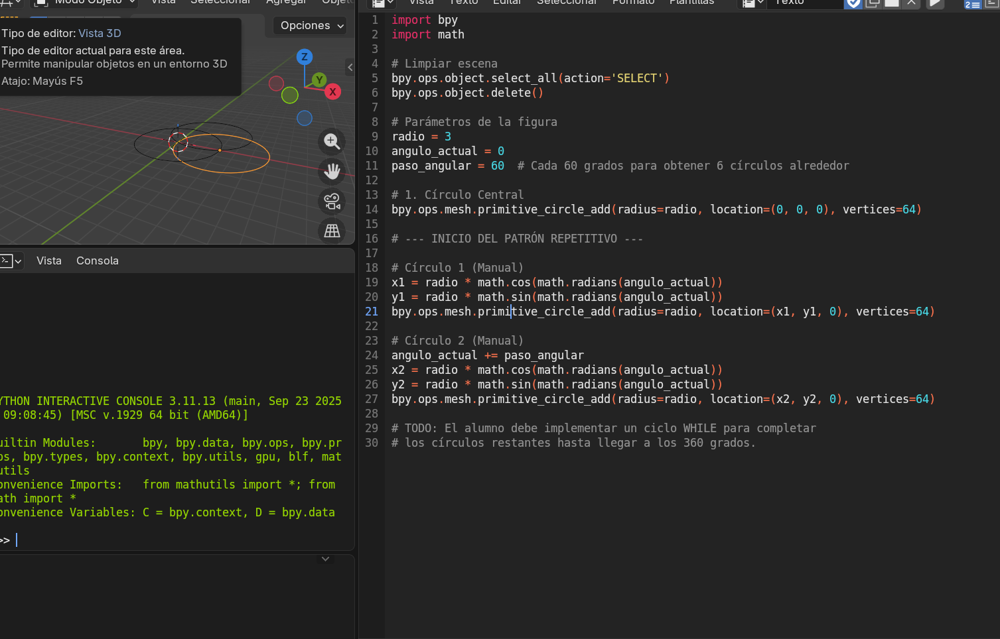
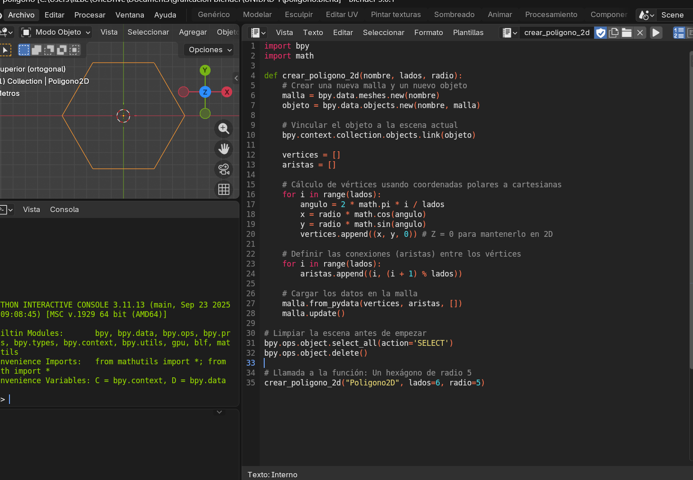

# Unidad 1

## Índice
- [1.1. Historia y evolución de la graficación por computadora](#11-historia-y-evolución-de-la-graficación-por-computadora)
- [1.2. Áreas de aplicación](#12-áreas-de-aplicación)
- [1.3. Aspectos matemáticos de la graficación](#13-aspectos-matemáticos-de-la-graficación)
- [1.4. Modelos del color: RGB, CMY, HSV y HSL](#14-modelos-del-color-rgb-cmy-hsv-y-hsl)
- [1.5. Representación y trazo de líneas y polígonos](#15-representación-y-trazo-de-líneas-y-polígonos)
  - [1.5.1. Formatos de imagen](#151-formatos-de-imagen)
- [1.6. Procesamiento de mapas de bits](#16-procesamiento-de-mapas-de-bits)

---

## 1.1. Historia y evolución de la graficación por computadora

La graficación por computadora surge a mediados del siglo XX como una forma de representar información visualmente en pantallas electrónicas. Sus principales hitos son:

- **Década de 1950**  
  - En el MIT se usaron **osciloscopios** para mostrar señales de radar, lo que permitió visualizar datos en tiempo real.  
  - La computadora **UNIVAC I** imprimía gráficos estadísticos en papel, un paso inicial hacia la comunicación visual digital.  

- **Década de 1960**  
  - Ivan Sutherland desarrolló **Sketchpad (1963)**, el primer programa de diseño gráfico interactivo. Permitía dibujar directamente en la pantalla con un lápiz óptico.  
  - Se introdujeron los primeros sistemas de **gráficos vectoriales**, usados en simuladores y aplicaciones militares.  

- **Década de 1970**  
  - Aparecen las primeras **interfaces gráficas de usuario (GUI)**, que reemplazaron comandos por iconos y ventanas.  
  - Empresas como **Atari** y **Nintendo** impulsaron los gráficos en videojuegos, popularizando el uso de imágenes digitales.  

- **Década de 1980**  
  - Se masifican las **computadoras personales** con capacidades gráficas.  
  - Surgen programas de diseño asistido por computadora (**CAD**) y software de animación.  
  - Los gráficos en 3D comienzan a usarse en cine y publicidad.  

- **Década de 1990 en adelante**  
  - Se perfeccionan los modelos de color (RGB, CMY, HSV, HSL) y los algoritmos de renderizado.  
  - Los videojuegos y el cine digital impulsan la creación de **gráficos tridimensionales realistas**.  
  - Internet y multimedia expanden la graficación hacia aplicaciones educativas, artísticas y comerciales.  

- **Actualidad**  
  - La graficación por computadora se integra con **realidad virtual, realidad aumentada e inteligencia artificial**, permitiendo experiencias inmersivas y simulaciones avanzadas.  
  - Se aplica en áreas como medicina, arquitectura, ingeniería, entretenimiento y ciencia de datos.  

## 1.2. Áreas de aplicación

La graficación por computadora se ha convertido en una disciplina transversal que impacta prácticamente todos los ámbitos de la vida moderna. Su capacidad para transformar datos en imágenes comprensibles y atractivas ha hecho que se utilice tanto en el entretenimiento como en la ciencia, la educación y la industria. En el **campo del entretenimiento**, los gráficos digitales son la base de los videojuegos, las películas animadas y los efectos especiales en cine y televisión. Gracias a ellos, se crean mundos virtuales, personajes realistas y experiencias inmersivas que han revolucionado la manera en que las personas interactúan con la narrativa audiovisual.  

En el **diseño asistido por computadora (CAD)**, la graficación es indispensable para arquitectos, ingenieros y diseñadores industriales, ya que permite elaborar planos, modelos tridimensionales y simulaciones que facilitan la visualización de proyectos antes de su construcción. Esto no solo ahorra tiempo y recursos, sino que también mejora la precisión y la comunicación entre equipos de trabajo.  

En el ámbito de la **educación y la comunicación**, los gráficos digitales se utilizan para crear materiales didácticos interactivos, presentaciones multimedia y simulaciones que ayudan a explicar conceptos complejos de manera sencilla. La visualización gráfica permite que estudiantes y profesionales comprendan fenómenos abstractos, como procesos químicos o modelos matemáticos, de forma más clara y accesible.  

Las **ciencias y la medicina** también se benefician enormemente de la graficación. En biología y química, se emplea para representar moléculas y estructuras celulares; en física, para simular fenómenos naturales; y en medicina, para procesar imágenes obtenidas mediante rayos X, resonancias magnéticas y tomografías computarizadas. Estas representaciones gráficas no solo facilitan el diagnóstico, sino que también permiten planificar tratamientos y cirugías con mayor precisión.  

En el **arte y el diseño gráfico**, la graficación por computadora ha abierto nuevas posibilidades creativas. Los artistas digitales pueden producir ilustraciones, animaciones y obras interactivas, mientras que los diseñadores gráficos utilizan software especializado para crear logotipos, campañas publicitarias y material visual que impacta en la comunicación de marcas y productos.  

La **industria y la manufactura** emplean gráficos digitales para simular procesos productivos, modelar prototipos y optimizar diseños antes de su fabricación. Esto reduce costos y riesgos, ya que permite detectar errores en etapas tempranas del desarrollo.  

En la **geografía y la cartografía digital**, los sistemas de información geográfica (SIG) utilizan graficación para representar mapas interactivos, analizar datos espaciales y facilitar la toma de decisiones en urbanismo, transporte y gestión ambiental.  

Finalmente, en la **realidad virtual y aumentada**, la graficación por computadora es el núcleo que permite crear entornos inmersivos y experiencias interactivas aplicadas en educación, entrenamiento militar, medicina y entretenimiento. Estas tecnologías combinan gráficos tridimensionales con sensores y dispositivos de visualización para ofrecer una interacción directa con mundos digitales.  

---

## 1.3. Aspectos matemáticos de la graficación

La graficación por computadora se fundamenta en una amplia variedad de conceptos matemáticos que permiten transformar datos abstractos en representaciones visuales comprensibles. Sin las matemáticas, sería imposible generar imágenes, simular escenas tridimensionales o manipular colores de manera precisa. Los principales aspectos matemáticos que intervienen son los siguientes:

En primer lugar, la **geometría analítica** constituye la base para describir objetos en el espacio. Los puntos, líneas, polígonos y superficies se representan mediante coordenadas en sistemas bidimensionales y tridimensionales. Gracias a la geometría, es posible definir la posición de un objeto, calcular distancias, determinar intersecciones y establecer relaciones espaciales entre diferentes elementos de una escena.  

La **álgebra lineal** es otro pilar fundamental. Los vectores y matrices se utilizan para realizar transformaciones geométricas como traslaciones, rotaciones, escalados y proyecciones. Por ejemplo, una matriz de transformación puede mover un objeto en el espacio tridimensional o cambiar su orientación respecto a un eje. Además, el álgebra lineal permite manejar sistemas de ecuaciones que describen cómo se proyecta un objeto tridimensional en una pantalla bidimensional, lo que constituye el núcleo del proceso de renderizado.  

La **trigonometría** se aplica en el cálculo de ángulos, longitudes y relaciones entre triángulos, lo cual es esencial para determinar perspectivas, calcular sombras y simular iluminación. Gracias a funciones trigonométricas como el seno y el coseno, se pueden modelar movimientos periódicos, ondas y efectos visuales que imitan fenómenos naturales.  

El **cálculo diferencial e integral** también desempeña un papel importante. El cálculo diferencial se utiliza para analizar la variación de funciones, lo que permite determinar pendientes y tangentes en curvas y superficies. Esto es clave en la generación de gráficos suaves y en la simulación de movimiento. El cálculo integral, por su parte, se emplea en la determinación de áreas, volúmenes y en el cálculo de iluminación global, donde se requiere integrar la contribución de múltiples fuentes de luz sobre una superficie.  

La **estadística y la probabilidad** intervienen en técnicas de renderizado como el *ray tracing* y el *path tracing*, donde se simula el comportamiento de millones de rayos de luz que interactúan con los objetos de la escena. Los métodos probabilísticos permiten aproximar fenómenos complejos como la dispersión, la reflexión difusa y la refracción, logrando imágenes más realistas.  

Otro aspecto relevante es la **teoría de grafos**, que se utiliza en la representación de redes de polígonos y en la optimización de estructuras de datos para el modelado de escenas. Los grafos permiten organizar la información de manera eficiente, facilitando la navegación entre nodos y la manipulación de jerarquías de objetos.  

Finalmente, la **matemática del color** se basa en modelos como RGB, CMY, HSV y HSL, que describen cómo se combinan los componentes cromáticos para generar diferentes tonalidades. Estos modelos se apoyan en transformaciones matemáticas que convierten valores numéricos en percepciones visuales, ajustando brillo, saturación y matices de manera precisa.  

---

## 1.4. Modelos del color: RGB, CMY, HSV y HSL

La representación del color en la graficación por computadora se basa en modelos matemáticos que permiten describir y manipular los colores de manera precisa. Estos modelos son fundamentales porque las computadoras trabajan con números, y para poder mostrar imágenes en pantalla o imprimirlas es necesario traducir las percepciones humanas del color a valores numéricos. Los principales modelos utilizados son RGB, CMY, HSV y HSL, cada uno con características y aplicaciones específicas.

El **modelo RGB (Red, Green, Blue)** es el más común en pantallas digitales. Se basa en la mezcla aditiva de los tres colores primarios de la luz: rojo, verde y azul. Cada color se representa mediante un valor numérico que indica la intensidad de cada componente, y la combinación de estos valores produce millones de colores diferentes. Por ejemplo, el blanco se obtiene cuando los tres componentes están en su máxima intensidad, mientras que el negro corresponde a la ausencia de luz. Este modelo es ideal para dispositivos que emiten luz, como monitores, televisores y proyectores.

El **modelo CMY (Cyan, Magenta, Yellow)**, y su variante **CMYK (que añade el negro, Key)**, se utiliza principalmente en impresión. A diferencia del RGB, este modelo se basa en la mezcla sustractiva de pigmentos. Cada componente absorbe parte de la luz blanca y refleja el resto, generando así el color percibido. Por ejemplo, el cian absorbe el rojo, el magenta absorbe el verde y el amarillo absorbe el azul. La combinación de los tres produce un color cercano al negro, aunque en la práctica se añade el componente K para obtener un negro más profundo y ahorrar tinta. Este modelo es esencial en la industria gráfica y editorial.

El **modelo HSV (Hue, Saturation, Value)** describe el color de una manera más cercana a la percepción humana. El matiz (*hue*) indica el tipo de color (rojo, azul, verde, etc.), la saturación mide la pureza o intensidad del color, y el valor representa el brillo. Este modelo es muy útil en aplicaciones de edición gráfica y diseño, ya que permite manipular los colores de forma intuitiva. Por ejemplo, un diseñador puede ajustar la saturación para obtener un tono más apagado o aumentar el valor para hacerlo más luminoso.

El **modelo HSL (Hue, Saturation, Lightness)** es similar al HSV, pero en lugar de usar el valor como medida de brillo, utiliza la luminosidad (*lightness*), que se define como el promedio entre el color más claro y el más oscuro posible. Esto hace que el modelo HSL sea más equilibrado para representar variaciones de color en interfaces gráficas y herramientas de diseño. Es especialmente útil cuando se necesita generar paletas de colores armónicas, ya que facilita la creación de tonos, sombras y matices relacionados.
Perfecto, aquí tienes un **tutorial narrativo y detallado** que puedes colocar en tu sección *1.4 Modelos del color* como ejemplo práctico:  

---

Cómo iluminar un cubo y sus caras en Blender

La iluminación es un aspecto esencial en la graficación por computadora, ya que determina cómo percibimos los colores, las texturas y la profundidad de los objetos. Para ilustrar este concepto, podemos realizar un ejercicio sencillo en **Blender**, creando un cubo y aplicando diferentes fuentes de luz para observar cómo cambia su apariencia.

1. **Crear el cubo**  
   - Abre Blender y en la escena inicial ya tendrás un cubo por defecto.  
   - Si lo eliminaste, puedes añadir uno nuevo desde el menú: `Add → Mesh → Cube`.  

2. **Configurar la cámara**  
   - Ajusta la cámara para que apunte directamente al cubo.  
   - Esto te permitirá visualizar claramente los efectos de la iluminación en cada cara.  

3. **Añadir una fuente de luz principal**  
   - Ve al menú `Add → Light → Point Light`.  
   - Coloca la luz frente al cubo, ligeramente elevada.  
   - Ajusta su intensidad en el panel de propiedades para que ilumine la cara frontal.  

4. **Iluminar las caras laterales**  
   - Añade una segunda luz (`Add → Light → Spot Light`) y colócala en un ángulo lateral.  
   - Configura el cono de luz para que cubra una de las caras laterales del cubo.  
   - Ajusta la intensidad para que no opaque la luz principal, creando contraste.  

5. **Iluminación de relleno y ambiente**  
   - Añade una tercera luz (`Add → Light → Area Light`) detrás o encima del cubo.  
   - Esta luz servirá como relleno, suavizando las sombras y dando mayor realismo.  
   - Puedes reducir su intensidad para que solo aporte un toque de claridad.  

6. **Aplicar materiales y colores**  
   - Selecciona el cubo y ve al panel de materiales.  
   - Asigna diferentes colores a cada cara para observar cómo la iluminación afecta la percepción cromática.  
   - Por ejemplo: rojo en la cara frontal, verde en la lateral y azul en la superior.  

7. **Renderizar la escena**  
   - Pulsa `F12` para renderizar.  
   - Observa cómo cada cara del cubo refleja la luz de manera distinta según su posición y el tipo de fuente utilizada.  

---

## 1.5. Representación y trazo de líneas y polígonos

La representación de líneas y polígonos constituye uno de los fundamentos más importantes de la graficación por computadora, ya que a partir de estas figuras básicas se construyen modelos más complejos como superficies, volúmenes y escenas tridimensionales. En esencia, todo objeto digital puede descomponerse en una colección de líneas y polígonos que, organizados adecuadamente, forman la estructura visual de la imagen.

Las **líneas** son el elemento más simple y se definen matemáticamente mediante ecuaciones en coordenadas cartesianas. Para dibujar una línea en una pantalla, la computadora debe convertir la ecuación matemática en una serie de píxeles encendidos. Los algoritmos de trazado de líneas, como el de **Bresenham** o el de **DDA (Digital Differential Analyzer)**, permiten calcular de manera eficiente qué píxeles deben activarse para representar una línea recta entre dos puntos. Estos algoritmos son esenciales porque garantizan que las líneas se dibujen con precisión y rapidez, evitando errores visuales como discontinuidades o irregularidades en la pendiente.

Los **polígonos**, por su parte, son figuras formadas por la unión de varias líneas. En graficación, los polígonos más utilizados son los **triángulos**, debido a que cualquier superficie compleja puede descomponerse en una malla de triángulos. Esta técnica, conocida como **triangulación**, es la base del modelado tridimensional en programas de diseño y animación. Los polígonos se representan mediante sus vértices y aristas, y la computadora calcula cómo deben rellenarse para mostrar superficies sólidas.  

El **relleno de polígonos** es otro aspecto clave. Existen algoritmos que determinan qué píxeles dentro de un polígono deben encenderse para simular una superficie continua. El algoritmo de **scanline**, por ejemplo, recorre la figura línea por línea y activa los píxeles correspondientes, mientras que técnicas más avanzadas utilizan interpolación para aplicar colores, texturas e iluminación.  

Además, la representación de líneas y polígonos está estrechamente vinculada con la **transformación geométrica**. Mediante matrices de transformación, los polígonos pueden trasladarse, rotarse, escalarse o proyectarse en diferentes planos. Esto permite que un mismo objeto se visualice desde distintos ángulos y perspectivas, lo cual es fundamental en la creación de escenas tridimensionales.  

En el ámbito práctico, los polígonos también se utilizan para definir **mallas de objetos 3D**. Cada cara de un modelo tridimensional está compuesta por polígonos que, al ser renderizados, forman la superficie visible del objeto. La calidad del modelo depende de la cantidad de polígonos: a mayor número, mayor detalle, aunque también aumenta el costo computacional.  

---

###1.5.1. Formatos de imagen

---

## 1.6. Procesamiento de mapas de bits

El procesamiento de mapas de bits es una de las áreas más importantes de la graficación por computadora, ya que se centra en la manipulación directa de las imágenes digitales en su forma más básica: una matriz de píxeles. Un **mapa de bits** (bitmap) es una representación de una imagen en la que cada píxel contiene información sobre el color y la intensidad de la luz en un punto específico. Al trabajar con mapas de bits, la computadora puede modificar, analizar y transformar imágenes con gran precisión.

En primer lugar, es necesario comprender que un mapa de bits se organiza como una **matriz bidimensional**. Cada posición de la matriz corresponde a un píxel, y cada píxel almacena valores numéricos que representan colores según un modelo cromático, generalmente **RGB**. Por ejemplo, un píxel puede contener tres valores: uno para el rojo, otro para el verde y otro para el azul, que combinados producen el color final.  

El procesamiento de mapas de bits incluye una amplia gama de operaciones. Una de las más comunes es la **transformación geométrica**, que permite rotar, escalar, trasladar o reflejar una imagen. Estas operaciones se realizan aplicando cálculos matemáticos sobre las coordenadas de los píxeles, lo que genera una nueva disposición de la imagen en pantalla.  

Otra operación fundamental es la **filtración de imágenes**, que consiste en aplicar algoritmos para modificar las características visuales de la imagen. Los filtros pueden suavizar bordes, eliminar ruido, resaltar detalles o detectar contornos. Por ejemplo, un filtro de desenfoque calcula el promedio de los valores de color de los píxeles vecinos para suavizar la transición entre ellos, mientras que un filtro de detección de bordes utiliza operaciones derivadas para identificar cambios bruscos en la intensidad.  

El procesamiento también incluye la **transformación de color**, que permite convertir una imagen de un modelo cromático a otro, ajustar el brillo, la saturación o el contraste, e incluso aplicar efectos artísticos. Estas operaciones son esenciales en edición fotográfica y en la preparación de imágenes para impresión o visualización en distintos dispositivos.  

Además, el procesamiento de mapas de bits se utiliza en la **compresión de imágenes**, que busca reducir el tamaño de los archivos sin perder demasiada calidad visual. Existen métodos de compresión sin pérdida, como PNG, que conservan toda la información original, y métodos con pérdida, como JPEG, que eliminan datos redundantes para lograr archivos más ligeros.  

En aplicaciones avanzadas, el procesamiento de mapas de bits se combina con técnicas de **visión por computadora** y **inteligencia artificial**, permitiendo reconocer patrones, identificar objetos y analizar escenas. Esto se aplica en áreas como la medicina (detección de tumores en imágenes médicas), la seguridad (reconocimiento facial) y la industria (inspección automática de productos).  

---

